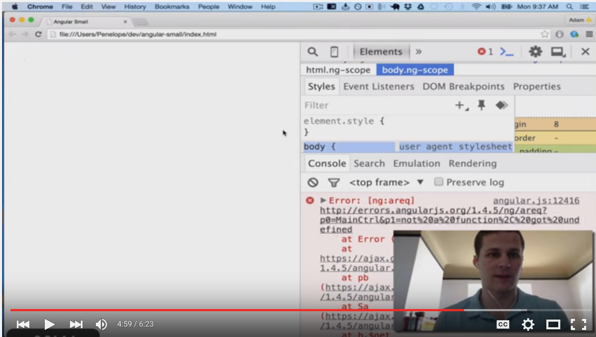

# Adding Controllers with ngController

> **Quick Note** - directives are written two ways: `ng-route`, `ng-show`, `ng-controller` and `ngRoute`, `ngShow`, `ngController`. They are referring to the same directive. In code it is always hyphenated, but written out it is often camel case.

Currently our app is pretty basic. Just one `index.html` file. Let's use that `app.js` file. Take your current `index.html` and update it to this:

```html
<!doctype html>
<html ng-app='redditApp'>
<head>
  <title>Reddit Angular</title>
  <script src="https://ajax.googleapis.com/ajax/libs/angularjs/1.4.4/angular.min.js"></script>
</head>
<body ng-controller="MainCtrl">

  <input type="text" ng-model="term" />
  <p>{{term}}</p>

</body>
</html>
```

Run this in the browser and what do you get. In this case you get this ugly error:

```
Uncaught Error: [$injector:modulerr] http://errors.angularjs.org/1.4.4/$injector/modulerr?p0=redditApp&p1=Error%…ogleapis.com%2Fajax%2Flibs%2Fangularjs%2F1.4.4%2Fangular.min.js%3A19%3A381)
```

## Debugging AngularJS

AngularJS has a rather strange way to debug. It actually sends your errors to an Angular documention website. So when you get an error, follow the links until you get to the actual error message. Here is a video illustrating how to debug angular:

[](https://youtu.be/P0PzejNU6Os?t=4m24s)

> **Remember** - about 50% of errors in Angular are syntax errors and the other 50% are injection errors, meaning you are calling a module or directive that you haven't injected into a controller yet.

## Moving on...

So to fix these problems lets add `app.js` to our template

```html
<head>
  <title>Reddit Angular</title>
  <script src="app.js"></script>
  ...
```

In `app.js`, let's initialize our app:

```js
angular.module('redditApp', []);
```

reloading we see that we have a new error:

```
Error: [ng:areq] http://errors.angularjs.org/1.4.4/ng/areq?p0=MainCtrl&p1=not%20a%20function%2C%20got%20undefined
```

That is because `MainCtrl` does not exist yet. Let's add it our app by chaining the `.controller()` function to our `angular.module()` function.

```js
angular.module('redditApp', [])
  .controller("MainCtrl", ['$scope', function($scope){

  }]);
```

Ok all working now.

## Looping with ngRepeat

And now we can add some data to scope and loop over it:

```js
$scope.pokemon = [
  {
    ndex: 25,
    name: 'Pikachu',
    type: 'Electric'
  },
  {
    ndex: 10,
    name: 'Caterpie',
    type: 'Bug'
  },
  {
    ndex: 39,
    name: 'Jigglypuff',
    type: 'Fairy'
  },
  {
    ndex: 94,
     name: 'Gengar',
    type: 'Ghost'
  },
  {
    ndex: 143,
    name: 'Snorlax',
    type: 'Normal'
  }
];
```

We could `console.log()` the `pokemon` variable in `$scope` or we could put a `debugger` break point, but instead let's look at the `pokemon` variable by rendering it on our template.

```html
<body ng-controller="MainCtrl">

  <input type="text" ng-model="term" />
  <p>{{term}}</p>

  {{pokemon}}

</body>
```

# Challenges

1. Now let's use `ng-repeat` to loop over the `pokemon`. Look up the `ng-repeat` docs to implement this.
1. Instead of pokemon, let's put mock post data for our Reddit.
1. Add bootstrap to your project. Style your posts data and template to look nice.
1. Add a navbar.
