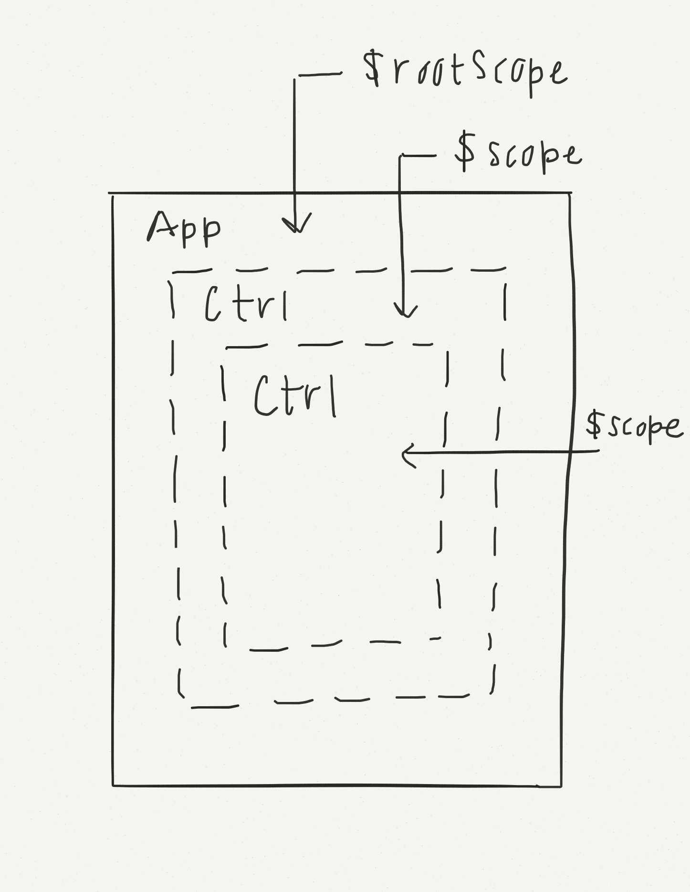

<hr><br>
## Learning Objectives
  * Strategize on Comparing Languages and Frameworks
  * Compare and Contrast Front End Frameworks
  * Understand $scope and module injection

<hr>

### Chapter Summary

Let's get jump into AngularJS, the leading front-end javascript framework. But first, let's talk a bit more about how to discuss and pick the tools we use.

# How to Pick Which Tool to Learn? - 20min

Usually if we take an engineering job we just have to learn whatever languages or frameworks that company uses. But sometimes we get to choose what language or framework we want to use. And there are lots and lots of tools out there to use. How do we go about picking the right one?

Pair up with a buddy and discuss the strategies you could take to pick a tool for a project, or a tool to learn in general? Should you learn the one that is the most popular? That has the most jobs available in it? That fits what job you want? That is tailored to a specific project's specs?

How could you go about answering these questions about a specific framework or language?

<!-- ```[solution]
  * [Compare their Github Stats](https://infogr.am/githuborg-8375525)
  * [Compare their Module Count](http://www.modulecounts.com/)
  * Compare how many job postings there are on Hacker News Jobs and on Linkedin.
  * ...
``` -->

# Learn about Front End Frameworks - 2hrs

## What is AngularJS?

"AngularJS is a structural framework for dynamic web apps. It lets you use HTML as your template language and lets you extend HTML's syntax to express your application's components clearly and succinctly. Angular's data binding and dependency injection eliminate much of the code you would otherwise have to write."
> References: [Angular Docs](https://docs.angularjs.org/guide/introduction)

## Front End Frameworks or Client-Side Architecture

Javascript front end frameworks emerged after JavaScript and browsers became fast enough to manage full featured clients and after the mobile revolution exposed the benefits of having a strong client and a service-oriented architecture. Front end frameworks are like building a website like an Android or iOS mobile app, except instead of downloading the client from an app store, the client is sent to the browser upon the first HTTP request.

## Benefits

Front end frameworks are server agnostic, meaning they don't care what language or pattern a server uses, just so long as it exposes webhook urls that return data in a structure the front end framework expects. Front end frameworks are "decoupled" from their servers.

A decoupled front end makes users' experience feel faster and more dynamic. Front end frameworks work like *Single Page Apps (SPAs)* and do not need to do complete page refreshes to navigate from page to page. Instead data is fetched independently with asynchronous calls to API services and then the client updates templates that are either cached or loaded through AJAX from a server.

A decoupled front end also simplifies the collaboration of a team of developers. The front end and back end teams only needs a single API spec to work off of to build their side of the app. This simplifies and accelerates project teams, timelines, and goals.

## Contrast with Rails

Consider a vanilla Rails app. With each request to the server an HTML template is rendered and served. The entire page reloads and a lot of data has to come over the network. The server is in charge of state. The client is basically just displaying HTML & CSS.

Now add a little jQuery, now the client can do some things independently but it still is not state-aware and as a developer you have to wire up every little event and its trigger and outcome.

What if you could put the client in the driver's seat and make it state-aware? Then when you updated state, the view would reflect the change without any extra effort. This is largely the goal of front end frameworks and AngularJS specifically.

# Front End Framework Battle Royal - 45min

Form into groups of at least 3 participants. Each person pick one of the leading [front end frameworks](https://github.com/showcases/front-end-javascript-frameworks). Don't forget [Angular2](http://angular.io/).

# Read Introductory docs for Angular and Answer these Questions:

[Introductory docs for Angular]( https://docs.angularjs.org/guide/introduction)

1. How does Angular differ from jQuery in how it keeps track of state and manipulates the DOM?
2. What is a two way data binding exactly and how would you use it?
3. What does it mean to have a controller attached to a piece of a view?
4. How does Angular make it easier to make full featured Single Page Applications?
5. What is "dependency injection" in Angular?

# $scope & Module Injection

Read the [Introduction to $scope](https://docs.angularjs.org/guide/scope) docs.

From the top through the **Scope Life Cycle** section and answer these questions:

1. What is `$scope`? How will you use it in AngularJS?
2. What is the relationship between any $scope and $rootScope?
3. What is the relationship between the $scope and the DOM?

## Analogy for `$scope`

Think of `$scope` as the string between two cans: one can is the views, the other is your linked controller.


## Nested `$scopes` and `$rootScope`

Scopes are arranged in a nested tree structure. Controllers are nested inside each other, and this nests their scopes. The parent or root scope of all scopes is `$rootScope`. Don't worry too much now about access data across scopes, just be aware of their nested structure.



## Module Dependency Injection

We all know that some code depends on other code to run. But if you include all your scripts in every controller, your app would be slow. Angular gives you the power to selectively inject dependent modules into controllers only when you need them. There are two different notations you will see, with an array and without. The array notation allows your code even if minified. Otherwise minification confuses the names of injected modules.

Look at this example where we are adding a controller. We are injecting three dependencies:

```
$scope - this is $scope
$http - this is a native AngularJS module for making $http requests
$routeParams - this is a module from ngRoute for accessing URL params.
```

The following two blocks of code are equivalent. But the second one can be minified.
```js
app.controller("GuitarDetailsController", function ($scope, $http, $routeParams) {
  $http.get('js/data.json').success (function(data){
    $scope.guitarVariable = data;
    $scope.whichGuitar = $routeParams.guitarID;
  });
});
```

```js
app.controller("GuitarDetailsController", ['$scope','$http','$routeParams',
  function ($scope, $http, $routeParams)
  {
    $http.get('js/data.json').success (function(data){
      $scope.guitarVariable = data;
      $scope.whichGuitar = $routeParams.guitarID;
    });
  }]
);
```

# Nice Work! On to the Next Article.
